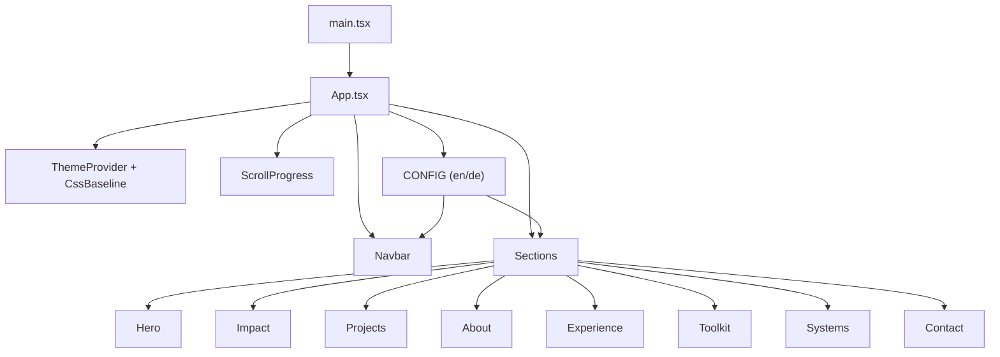
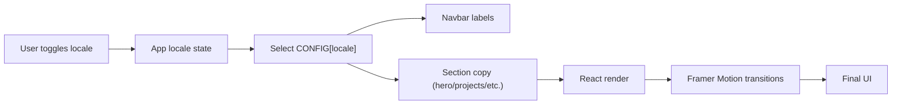

# Luaj Osman | Personal Portfolio

<p align="center">
  
</p>

A full-screen, animation-rich developer portfolio built with React, TypeScript, Vite, MUI, and Framer Motion.

## Overview

This project is a modular single-page portfolio focused on:

- strong visual identity
- stable animations and smooth interaction
- reusable section/component architecture
- bilingual content (`en` / `de`) from one config source

The site includes a modern hero, impact metrics, projects, experience, skills toolkit, and a dedicated systems area with interactive Apple-terminal style components.

## Key Features

- Full-screen responsive layout with centered content
- Section-based architecture (`Hero`, `Impact`, `Projects`, `About`, `Experience`, `Toolkit`, `Systems`, `Contact`)
- Locale switching between English and German
- Reusable motion primitives and reveal patterns
- Interactive terminal components:
  - command deck terminal
  - repo/file navigator terminal
  - pipeline matrix terminal
- CV-backed projects and skills linked to GitHub

## Tech Stack

- `React 19`
- `TypeScript`
- `Vite 7`
- `MUI 7` (`@mui/material`, `@mui/icons-material`)
- `Framer Motion`
- `Three.js` + `@react-three/fiber` + `@react-three/drei` (available for 3D/visual modules)
- `ESLint` for linting

## Application Structure

```text
src/
  App.tsx
  config.ts
  app/theme.ts
  components/
    Navbar.tsx
    Section.tsx
    MiniTerminal.tsx
    CommandDeckTerminal.tsx
    RepoTreeTerminal.tsx
    PipelineMatrixTerminal.tsx
    ...
  sections/
    Hero.tsx
    Impact.tsx
    Projects.tsx
    About.tsx
    Experience.tsx
    Toolkit.tsx
    Systems.tsx
    Contact.tsx
public/
  favicon.svg
  cv.pdf
```

## Architecture Diagram



## Content + Rendering Flow



## Section Map

| Section | Purpose | Main Files |
|---|---|---|
| Hero | First impression, CTA, operational snapshot | `src/sections/Hero.tsx`, `src/components/FloatingStatCard.tsx` |
| Impact | Metrics and engineering pillars | `src/sections/Impact.tsx`, `src/components/MetricCounter.tsx` |
| Projects | Featured work with modal/code links | `src/sections/Projects.tsx`, `src/components/ProjectModal.tsx` |
| About | Positioning + core tech groups | `src/sections/About.tsx` |
| Experience | Timeline-style career history | `src/sections/Experience.tsx` |
| Toolkit | Skill lanes and delivery focus | `src/sections/Toolkit.tsx`, `src/components/TagMarquee.tsx` |
| Systems | Interactive terminal-style engineering panels | `src/sections/Systems.tsx`, `src/components/*Terminal.tsx` |
| Contact | Contact form and direct email | `src/sections/Contact.tsx` |

## Setup

### 1. Install dependencies

```bash
npm install
```

### 2. Run development server

```bash
npm run dev
```

### 3. Build production bundle

```bash
npm run build
```

### 4. Preview production build

```bash
npm run preview
```

## Available Scripts

| Script | Description |
|---|---|
| `npm run dev` | Start Vite dev server |
| `npm run build` | Type-check and create production build |
| `npm run lint` | Run ESLint |
| `npm run preview` | Preview production build locally |

## Customization Guide

### Update content

Edit:

- `src/config.ts`

This file controls:

- metadata (title/description)
- nav labels
- all section text
- project entries + links
- skills/toolkit lanes
- localized copy (`en` / `de`)

### Update theme and visual language

Edit:

- `src/app/theme.ts`
- `src/index.css`

### Add or reorder sections

Edit:

- `src/App.tsx`

## Performance + Stability Notes

- Animations are intentionally tuned for stability and smoothness.
- Section transitions use controlled motion timing to reduce flicker.
- Components are split into reusable blocks to keep rendering predictable.

## Deployment

This app is a static frontend and can be deployed to platforms like:

- Vercel
- Netlify
- GitHub Pages

The production output is generated in `dist/` after `npm run build`.

## Contact

- GitHub: [luajosman](https://github.com/luajosman)
- LinkedIn: [luaj-osman](https://www.linkedin.com/in/luaj-osman/)
- Email: `luaj.osman@gmail.com`
